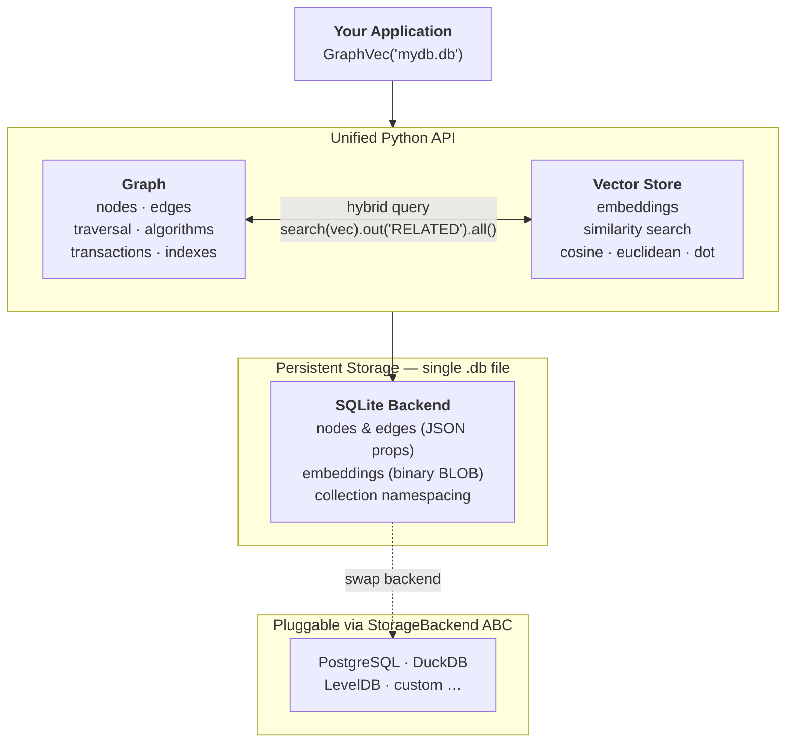
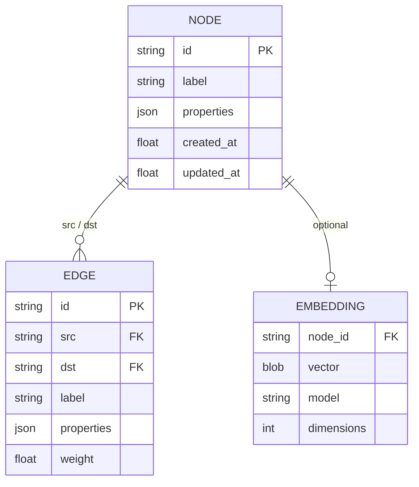

# graphvec

**Embedded, serverless, persistent graph database with vector search — pure Python, zero required dependencies.**

```
pip install graphvec          # stdlib-only core
pip install graphvec[vector]  # + numpy for faster vector ops
pip install graphvec[viz]     # + matplotlib + networkx for visualisation
pip install graphvec[pandas]  # + pandas for .to_dataframe()
pip install graphvec[faiss]   # + faiss-cpu for ANN on large graphs

# or with uv
uv add graphvec
uv add "graphvec[vector]"
```

---

## Why graphvec?

| | graphvec | ChromaDB | NetworkX | Neo4j CE |
|---|---|---|---|---|
| Embedded (no server) | ✅ | ✅ | ✅ | ❌ |
| Persistent by default | ✅ | ✅ | ❌ | ✅ |
| Property graph model | ✅ | ❌ | ✅ | ✅ |
| Vector similarity search | ✅ | ✅ | ❌ | ❌ (plugin) |
| Graph traversal API | ✅ | ❌ | ✅ | ✅ (Cypher) |
| Hybrid vector + graph | ✅ | ❌ | ❌ | ❌ |
| Zero mandatory deps | ✅ | ❌ | ❌ | ❌ |
| Python-native fluent API | ✅ | Partial | Partial | ❌ |
| ACID transactions | ✅ | ❌ | ❌ | ✅ |
| Built-in PageRank / BFS | ✅ | ❌ | ✅ | ✅ |

---

## Quickstart

```python
from graphvec import GraphVec

# Persistent database (single file, SQLite under the hood)
db = GraphVec("mydb.db")

# Or in-memory for tests / one-off scripts
db = GraphVec(":memory:")

# Add nodes
db.add_node("alice", label="Person", name="Alice", age=30)
db.add_node("bob",   label="Person", name="Bob",   age=25)
db.add_node("carol", label="Person", name="Carol", age=28)

# Add edges
db.add_edge("alice", "bob",   label="KNOWS", since=2020)
db.add_edge("bob",   "carol", label="KNOWS", since=2021)

# Traversal
friends = db.v("alice").out("KNOWS").all()
print(friends[0]["name"])  # Bob

# 2-hop traversal
two_hop = db.v("alice").out("KNOWS", hops=2).all()

# Filters
active = db.v(label="Person").has(age=30).all()
seniors = db.v(label="Person").where(lambda n: n["age"] > 27).all()

# Path finding
path = db.path("alice", "carol")
print([n.id for n in path.nodes])  # ['alice', 'bob', 'carol']

# Algorithms
pr = db.pagerank()
db.bfs("alice", max_depth=3)
db.connected_components()
```

---

## Vector Search

```python
from graphvec import GraphVec

# Auto-embed on insert
def my_embed(text: str) -> list[float]:
    ...  # call OpenAI / sentence-transformers / etc.

db = GraphVec("kg.db", embed_fn=my_embed, embed_field="content")

db.add_node("d1", label="Document", content="graphvec is a graph database")
db.add_node("d2", label="Document", content="vector search with embeddings")

# Search by vector
results = db.search(my_embed("graph database"), k=5)
for r in results:
    print(r.node.id, r.score)

# Search by text (requires embed_fn)
results = db.search_text("what is a knowledge graph", k=3)

# Metrics
db.search(vec, k=5, metric="cosine")     # default
db.search(vec, k=5, metric="euclidean")
db.search(vec, k=5, metric="dot")

# Hybrid: vector search -> graph traversal
related_docs = (
    db.search(query_vec, k=3, label="Document")
      .out("RELATED_TO")
      .all()
)
```

---

## Collections

```python
# Isolated graph namespaces within one file
db = GraphVec("mydb.db")

beliefs  = db.collection("beliefs")
evidence = db.collection("evidence")

beliefs.add_node("b1", label="Belief", text="...")
evidence.add_node("e1", label="Evidence", source="...")

db.list_collections()          # ['default', 'beliefs', 'evidence']
db.drop_collection("beliefs")
```

---

## Transactions

```python
# Context manager -- all operations are buffered and committed atomically.
# Any exception triggers a full rollback; nothing is persisted.
with db.transaction():
    db.add_node("n1", label="Claim", text="...")
    db.add_node("n2", label="Evidence", source="...")
    db.add_edge("n1", "n2", label="SUPPORTED_BY")

# Manual
txn = db.begin()
try:
    db.add_node(...)
    db.add_edge(...)
    txn.commit()
except Exception:
    txn.rollback()

# Bulk inserts are automatically wrapped in a single transaction
db.add_nodes([{"id": "n1", "label": "X"}, {"id": "n2", "label": "Y"}])
db.add_edges([{"src": "n1", "dst": "n2", "label": "Z"}])
```

---

## Import / Export

```python
db.export_json("graph.json")
db.import_json("graph.json")

db.export_csv("nodes.csv", "edges.csv")
db.import_csv("nodes.csv", "edges.csv")

# NetworkX interop (requires graphvec[viz])
nx_graph = db.to_networkx()
db.from_networkx(nx_graph)

# Subgraph
db.subgraph(["n1", "n2", "n3"]).export_json("sub.json")
```

---

## Indexes

```python
db.create_index("nodes", "label")
db.create_index("edges", "label")
db.create_index("nodes", "properties.confidence")   # JSON field
db.list_indexes()
db.drop_index("nodes", "label")
```

---

## Visualisation

```python
# Requires: pip install graphvec[viz]
db.visualize()                                # interactive window
db.visualize(output="graph.png")              # save to file
db.visualize(highlight=["n1", "n2"])         # highlight nodes
db.subgraph(["n1", "n2", "n3"]).visualize()  # subgraph
```

---

## Full API Reference

### GraphVec (top-level)

| Method | Description |
|--------|-------------|
| `GraphVec(path, *, embed_fn, embed_field, backend)` | Open a database |
| `collection(name)` | Get / create a named collection |
| `list_collections()` | List all collections |
| `drop_collection(name)` | Delete a collection |
| `close()` | Release connection |

### Node API

| Method | Returns |
|--------|---------|
| `add_node(id, label, **props)` | `Node` |
| `get_node(id)` | `Node or None` |
| `update_node(id, **props)` | `Node` |
| `delete_node(id)` | `None` |
| `nodes(label=None, **filters)` | `list[Node]` |
| `node_count()` | `int` |
| `node_exists(id)` | `bool` |
| `add_nodes(list[dict])` | `list[Node]` |

### Edge API

| Method | Returns |
|--------|---------|
| `add_edge(src, dst, label, weight, **props)` | `Edge` |
| `get_edge(id)` | `Edge or None` |
| `update_edge(id, **props)` | `Edge` |
| `delete_edge(id)` | `None` |
| `edges(label, src, dst, **filters)` | `list[Edge]` |
| `edge_count()` | `int` |
| `edge_exists(src, dst, label)` | `bool` |
| `add_edges(list[dict])` | `list[Edge]` |

### Traversal

| Step | Description |
|------|-------------|
| `g.v(id, label)` | Seed traversal |
| `.out(label, hops)` | Follow outgoing edges |
| `.in_(label, hops)` | Follow incoming edges |
| `.both(label, hops)` | Either direction |
| `.has(**props)` | Filter by property |
| `.has_label(label)` | Filter by label |
| `.has_not(**props)` | Negative property filter |
| `.where(fn)` | Arbitrary predicate |
| `.limit(n)` | Cap results |
| `.skip(n)` | Offset |
| `.all()` | `list[Node]` |
| `.first()` | `Node or None` |
| `.count()` | `int` |
| `.ids()` | `list[str]` |
| `.to_dataframe()` | `pd.DataFrame` |

### Vector Search

| Method | Returns |
|--------|---------|
| `set_embedding(node_id, vector, model)` | `None` |
| `get_embedding(node_id)` | `list[float]` |
| `search(vector, k, metric, label)` | `SearchTraversal` |
| `search_text(text, k, metric, label)` | `SearchTraversal` |

### Graph Algorithms

| Method | Returns |
|--------|---------|
| `degree(id)` | `int` |
| `in_degree(id)` | `int` |
| `out_degree(id)` | `int` |
| `bfs(start, max_depth)` | `list[str]` |
| `dfs(start, max_depth)` | `list[str]` |
| `shortest_path(src, dst, max_hops)` | `list[str] or None` |
| `path(src, dst, max_hops)` | `Path or None` |
| `all_paths(src, dst, max_hops)` | `list[Path]` |
| `neighbors(id, hops)` | `list[Node]` |
| `connected_components()` | `list[set[str]]` |
| `is_connected()` | `bool` |
| `pagerank(damping, iterations)` | `dict[str, float]` |

---

## Architecture



```
graphvec/
+-- db.py          GraphVec class -- entry point + collection management
+-- graph.py       Graph class -- all node/edge/traversal/search/algo methods
+-- traversal.py   Fluent Traversal + SearchTraversal builders
+-- vector.py      VectorStore -- embedding storage + similarity search
+-- algorithms.py  BFS, DFS, PageRank, connected components (stdlib only)
+-- transaction.py Transaction context manager
+-- index.py       Index management
+-- io.py          JSON, CSV, NetworkX import/export
+-- models.py      Node, Edge, Path, SearchResult dataclasses
+-- exceptions.py  Typed exception hierarchy
+-- viz.py         Visualisation (optional dep)
+-- storage/
    +-- base.py    StorageBackend ABC
    +-- sqlite.py  SQLite implementation (default)
```

**Data model** — every node can carry both structured properties and a vector embedding, making graph traversal and semantic search composable on the same data:



**Storage layer**: All data lives in a single SQLite file. WAL mode is
enabled for concurrent reads. Node/edge properties are stored as JSON
columns; embeddings as binary BLOBs. Collections use table-name
prefixing (`<collection>_nodes`, `<collection>_edges`, ...).

**Transaction semantics**: Individual operations auto-commit when called
outside a transaction. Inside `with g.transaction()` or after
`g.begin()`, all writes are buffered until an explicit commit — or rolled
back atomically on any exception. Bulk `add_nodes()` / `add_edges()` are
always executed in a single transaction.

**Custom backends**: Implement `StorageBackend` (13 abstract methods) and
pass an instance via `GraphVec(backend=my_backend)`. No other code
changes required.

---

## Exceptions

```python
from graphvec import (
    GraphVecError,      # base -- catch all graphvec errors
    NodeNotFound,
    EdgeNotFound,
    EmbeddingNotFound,
    StorageError,
    CollectionNotFound,
)
```

---

## Development

```bash
git clone https://github.com/yourusername/graphvec
cd graphvec
uv venv .venv && source .venv/bin/activate
uv add -e ".[dev]"

# Run tests
pytest tests/ --cov=src/graphvec

# Lint
ruff check src/ tests/
```

---

## Licence

Apache 2.0 -- see [LICENCE](LICENCE).
